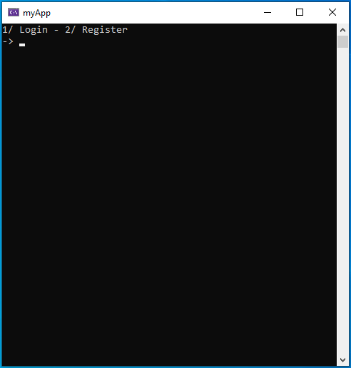

What is Eauth?
==============

https://eauth.us.to/ - Your #1 Free and Powerful Software Licensing Solution, Ultimately providing you with the most secure features and easy to use on an authentication system.    

Terms of Service
----------------
- Cheating or the use of malicious software is not allowed. Read https://eauth.us.to/tos/
  
Documentation
-------------

https://eauth.us.to/docs/


Example
-------------

https://github.com/Eauth786/Eauth-CPP-Console

Installation
-------------

You can download and install cpr, and OpenSSL using the [vcpkg](https://github.com/Microsoft/vcpkg) dependency manager:
```Bash
git clone https://github.com/Microsoft/vcpkg.git
cd vcpkg
bootstrap-vcpkg.sh
vcpkg install cpr:x86-windows
vcpkg install cpr:x64-windows
vcpkg install openssl:x86-windows
vcpkg install openssl:x64-windows
vcpkg integrate install
```
